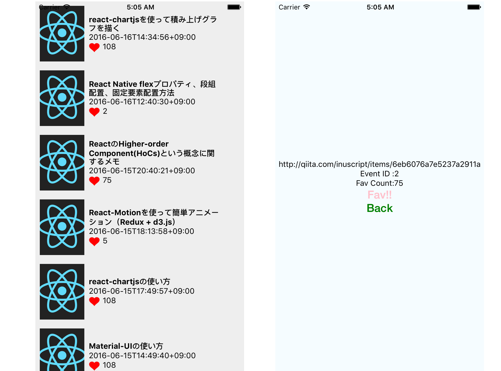

# React Native お試し

## 実行方法

### iOS
```
$ git clone https://github.com/osushi-dayo/React-Native-Research.git
$ cd React-Native-Research/
$ npm install
$ react-native run-ios
```
シミュレータにフォーカスして ⌘+Ctr+z で更新とかデバッグコンソール開く

### Android
```
$ git clone https://github.com/osushi-dayo/React-Native-Research.git
$ cd React-Native-Research/
$ npm install
(シミュレーターを起動。Genymotionだとダメだった…たぶんポートの問題)
$ react-native run-android
```
シミュレータにフォーカスして r 二連打で更新

## screen shot


## やっていること
* jsコード共通化(ほぼ全部同一コード)
* モジュール化
* リストビュー・遷移・ネットワーク
  * getリクエストでjsonを受け取ってリストビューに表示
  * リスト要素をタップで詳細画面へ遷移
  * ファボっぽいもの
  * リスト画面へ戻る
  * (ファボは即時反映されない…)
* ちょっとデザイン
* 別画面での値の受け渡し

## 概要
* webviewではない
* JSランタイムがあり、ネイティブのAPIを叩いている。(JSをネイティブコードに変換しているわけではない。)
* iOS特有のUIをAndroidで実現するのは無理。逆も同じ。

## 良い点
* Viewもロジックかなり共通化できる
* SwiftやJavaのオブジェクトに変換しなくていい(jsonだけ考えていればいい)


## 困った
* ただデータを置くだけでreactiveに変更されるわけではない(?)
  * →そのためにReduxがあるっぽい(?)
* CSS(Flexbox)でのレイアウトが辛すぎる。
* ネイティブみたいに気軽に(?)画面遷移を実装できない。
  * androidのバックボタンの制御も自前実装
* Xcode, Android Stdioの色んな補完・便利機能が使えない(地味に嫌)

## たぶん困る
* ライブラリ開発者(特にAWS!!)はreact-nativeでの使用を想定していない
* 急進的なアップデートについていかないとダメ
* パッケージ選定が面倒になりそう
* ちょっとしたUIの調整が難しそう
  * マルチ解像度対応
  * 文字列の長さに応じてviewの大きさ変える など
* コードの分け方で揉めそう
* React/Redux(Flux)とローカルDBを一緒に使うときに面倒そう
* メモリに乗ってるstateはバックグラウンド時に消えたりしないのだろうか
